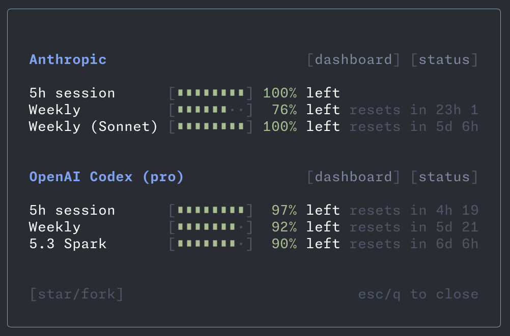

# pi-llm-usage

A small [Pi](https://github.com/earendil-works/pi) extension that adds a `/usage` command to show LLM subscription usage in an overlay.



## Install

Add this package to `~/.pi/agent/settings.json` or a project `.pi/settings.json`:

```json
{
  "packages": [
    "~/path/to/pi-tools/packages/pi-llm-usage"
  ]
}
```

Then run `/reload` in Pi.

## Usage

```text
/usage
```

Shows usage windows for:
- Anthropic (5h / weekly / model-specific when available)
- OpenAI Codex (session / weekly)

Close with `Esc`, `Enter`, or `q`.

### Codex "premium" limit detection

The Codex `wham/usage` endpoint only reports the standard 5h/weekly windows. It
does **not** expose the per-feature **premium** rate-limit bucket that premium
models (e.g. `gpt-5.6-sol` or `gpt-5.5`) burn — so `/usage` (and the ChatGPT/Codex app) can show
"60% left" while a premium request is actually rejected with a 429.

That premium bucket only appears in the `X-Codex-*` headers of a real 429, which
Pi records in its session logs. When a recent Codex `usage_limit_reached` 429 is
still within its reset window, `/usage` scans those logs and surfaces an extra
window (e.g. `Premium 5h`) plus a note explaining the source. The indicator
clears automatically once the reported reset time passes.

## Notes

- Uses your existing OAuth sessions (no API keys required)
- Reads credentials from `~/.pi/agent/auth.json` and falls back to `~/.codex/auth.json` for Codex
- Launch at any time, even when a session is active
- Feel free to open an issue/pr to add support for more providers

## License

MIT
